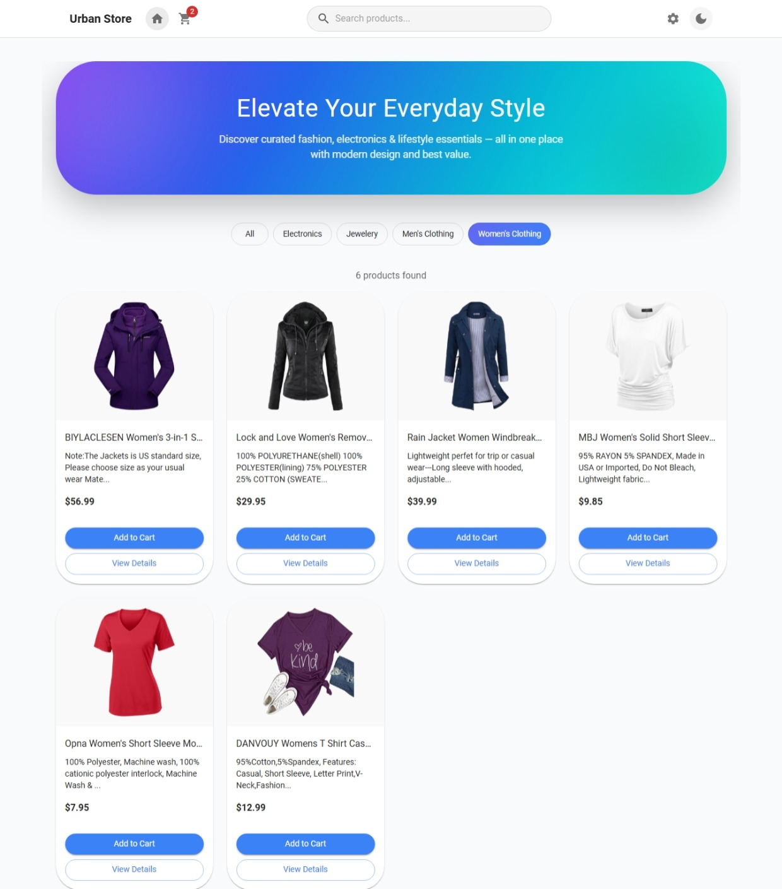
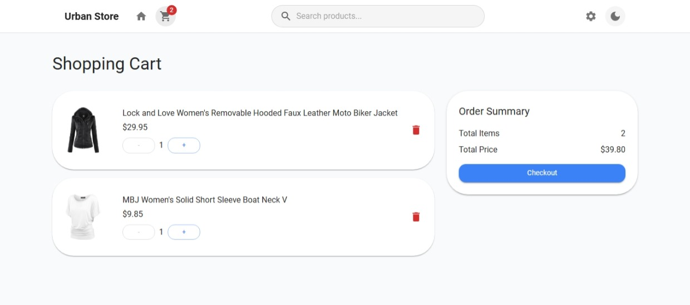
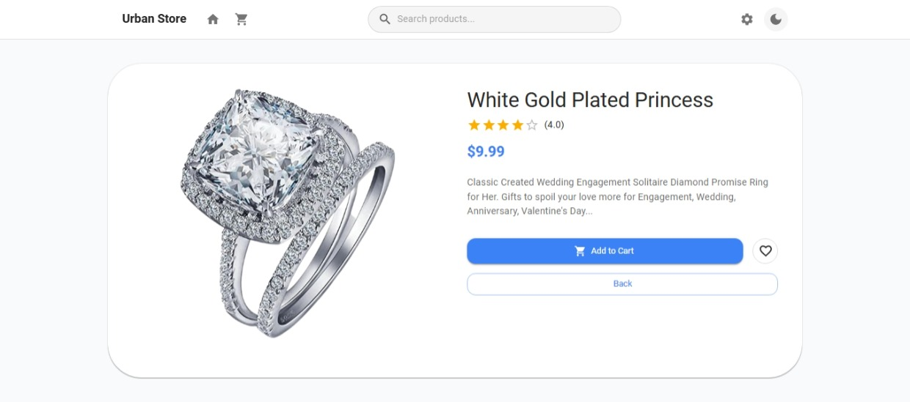
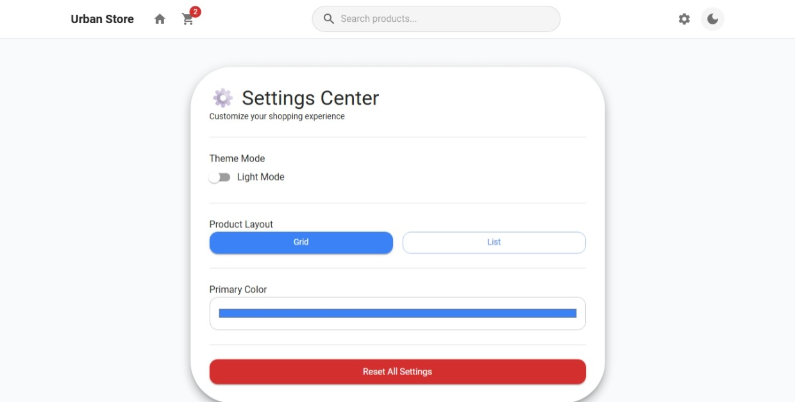

#  Urban Store
 
 Live Demo: 

##  Project Overview

Urban Store is a modern React-based e-commerce application built as a practical project to demonstrate advanced state management and API handling in React.

The project combines three different state management approaches:

- Context API + useReducer → UI settings (theme, layout)
- Redux Toolkit → Shopping cart management
- React Query → Server state (products fetching)

This project focuses on understanding when and why to use different state management tools in real-world applications.

---

##  Features

###  App Settings (Context API + useReducer)
- Dark / Light mode toggle 
- Grid / List view toggle 
- Global settings without prop drilling

---

###  Shopping Cart (Redux Toolkit)
- Add products to cart
- Remove products from cart
- Increase / decrease quantity
- Clear cart
- Show total items
- Calculate total price

---

###  Product Data (React Query)
- Fetch products from Fake Store API
- Loading state 
- Error handling 
- Cached data 
- Custom hook (useProducts)

---

###  Pages
- Home Page (Product listing)
- Product Details Page
- Cart Page
- Settings Panel

---

###  UI Features
- Fully responsive design 
- Modern Material UI design
- Clean and reusable components
- Dark/Light theme support

---

##  Tech Stack & Libraries

###  Core
- React ^19.2.5
- React DOM ^19.2.5

###  UI & Styling
- Material UI (MUI) ^9.0.0
- MUI Icons ^9.0.0
- Emotion (@emotion/react, @emotion/styled)
- React Icons ^5.6.0

###  State Management
- Redux Toolkit ^2.11.2
- React Redux ^9.2.0
- Context API + useReducer

###  Data Fetching
- React Query (@tanstack/react-query) ^5.100.8
- Axios ^1.15.2

###  Routing
- React Router DOM ^7.14.2

---

##  Project Structure

/src
│
├── app/
│ ├── store.js
│ └── queryClient.js
│
├── features/ cart/
│ ├── cartSlice.js
│ 
│
├── context/
│ ├── SettingsContext.jsx
│ └── settingsReducer.jsx
│
├── api/
│ └── productsApi.js
│
├── hooks/
│ └── useProducts.js
│
├── components/
│ ├── Navbar.jsx
│ ├── ProductCard.jsx
│ ├── Loader.jsx
│ ├── ErrorMessage.jsx
│ └── SettingsPanel.jsx
│
├── pages/
│ ├── Home.jsx
│ ├── Cart.jsx
│ └── ProductDetails.jsx
│
├── routes/
│ └── AppRoutes.jsx
│
├── App.jsx
└── main.jsx

###  Home Page

###  Cart Page

###  Product Details

###  Settings Panel

##  Installation & Setup
npm install
npm run dev

## API Used
Fake Store API

## Notes

This project is built for educational purposes and focuses on state management architecture rather than just UI design.